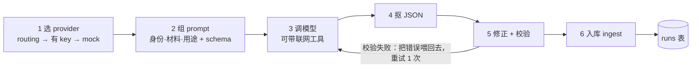
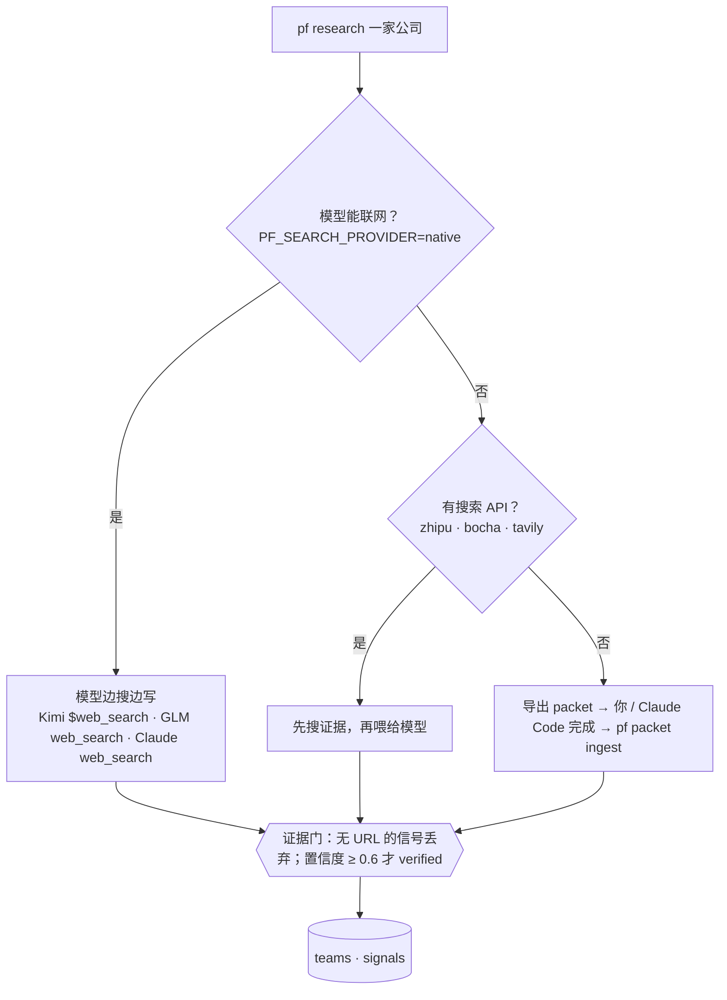
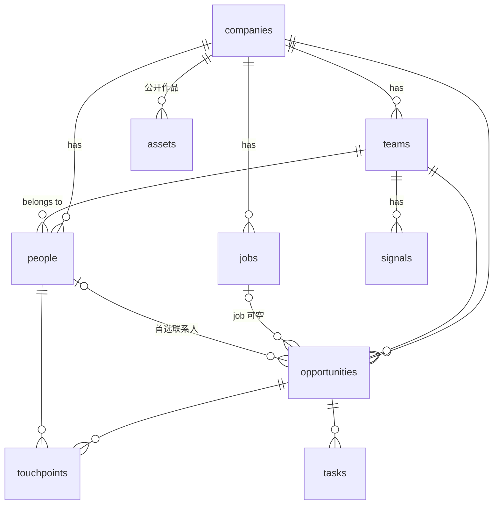

# 07 · 架构

> 一句话：模型做判断，代码做记账；系统起草，人来发送。

## 三层分离

```mermaid
flowchart LR
  CFG[config/*.yaml<br/>profile · scoring · taxonomy · seeds · sources · models] --> J
  subgraph J[判断层 stages/]
    direction LR
    scan --> discover --> research --> people --> rank --> outreach --> cards --> brief
  end
  J -- "prompt + schema" --> M[模型 llm/router<br/>Kimi K3 · GLM-5.3 · DeepSeek · Claude(可选) · mock]
  M -- "JSON（校验后）" --> J
  J -- "特征 + 证据（带 URL）" --> DB[(记账层 db.py · SQLite)]
  DB -- "确定性评分 · 状态机 · 排期" --> P[呈现层 templates/<br/>作战卡 · 日报 · 触达文案]
  P -- 起草 --> H((你))
  H -- "pf crm touch / people add / packet ingest" --> DB
```

## 一次模型调用（router.call）



## 证据规则



## 数据模型



## CRM 状态机

```mermaid
stateDiagram-v2
  direction LR
  [*] --> identified
  identified --> researched : research 验证团队
  researched --> people_found : people assess
  people_found --> outreach_drafted : pf outreach
  outreach_drafted --> contacted : first_msg（+60h follow-up 1）
  contacted --> replied : reply（取消 follow-up，+24h 推进）
  contacted --> parked : 2 次 follow-up 无回复
  replied --> in_conversation : call / meeting（+24h 感谢 + 价值）
  in_conversation --> referral_requested : ask（+5d 确认）
  referral_requested --> referred : referral
  referred --> applied
  applied --> interviewing
  interviewing --> offer
  offer --> closed_won
```



人物关系与路径等级：`cold/contacted L1 → replied L2 → warm L3（HM 则 L4）→ advocate L5（HM）`。

## 模型分工（2026-09）

| 任务 | provider | 联网 |
|---|---|---|
| title_expand | kimi · kimi-k3 | — |
| company_enrich | zhipu · glm-5.3 | — |
| jd_classify | deepseek · deepseek-chat | — |
| team_research | kimi · kimi-k3 | $web_search 内置工具 |
| people_assess | zhipu · glm-5.3 | web_search 工具 |
| fit_assess | deepseek · deepseek-chat | — |
| outreach_write / card_write | kimi（可改 anthropic） | — |

降级顺序 kimi → zhipu → deepseek → qwen → anthropic → mock。模型 ID 以各家官网为准。
